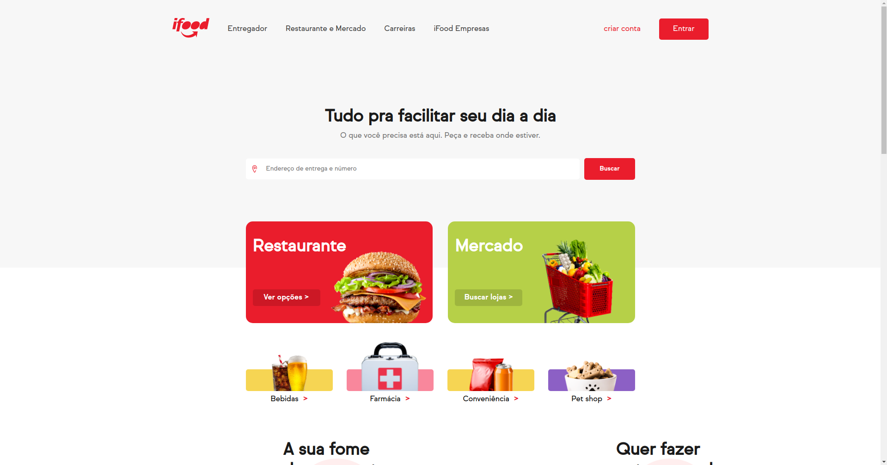

    <a href="https://miguelrisquelme.github.io/uiclone-ifood/" align="center">Clone</a> | <a href="https://www.ifood.com.br/" align="center">Official</a>  

<h1 align="center">UI Clone IFood</h1>

Hello this is a project made to apply the knowledge obtained in the courses of Git, HTML, CSS from <a href="https://www.alura.com.br/">Alura</a>. It was two days of development where I was able to apply more advanced knowledge of CSS and use HTML5 tags correctly. The site has images from the iFood image bank itself and also links to the official site, I didn't make it responsive in the same way as the site, besides, I also decided not to make some parts of the site, so it's not a faithful clone , YET!

 
 

## Preview Images

 
 

## What is missing?

- Restaurant sliders
- Promotions slider
- Side Menu
- Hover opacity in some links

 
 

## References

- <a href="https://developer.mozilla.org/pt-BR/docs/Web/CSS/@font-face" target="_blank">Font Face CSS</a>
- <a href="https://www.eversondaluz.com.br/fixar-menu-no-topo-css" target="_blank">Fix Menu on Top</a>
- <a href="https://developer.mozilla.org/pt-BR/docs/Web/CSS/:not" target="_blank">Pseudo-class CSS :not()</a>
- <a href="https://jakearchibald.github.io/svgomg/" target="_blank">SVG Optimizer</a>
- <a href="https://developer.mozilla.org/pt-BR/docs/Web/CSS/:nth-child" target="_blank">Pseudo-class CSS :nth-child()</a>
- <a href="https://www.ifood.com.br/" target="_blank">iFood Website</a>
- <a href="https://www.w3schools.com/tags/tag_thead.asp" target="_blank">TAG thead</a>
- <a href="https://developer.mozilla.org/pt-BR/docs/Web/HTML/Element/aside" target="_blank">TAG article</a>
- <a href="https://developer.mozilla.org/pt-BR/docs/Web/HTML/Element/aside" target="_blank">TAG aside</a>
- <a href="https://web.fe.up.pt/~ee96100/projecto/Tabela%20ascii.htm" target="_blank">Tabela ASCII</a>
- <a href="https://cursos.alura.com.br/" target="_blank">Alura</a>

Developed by <a href="https://bit.ly/miguelrisquelme"> Miguel Riquelme </a>with ❤
